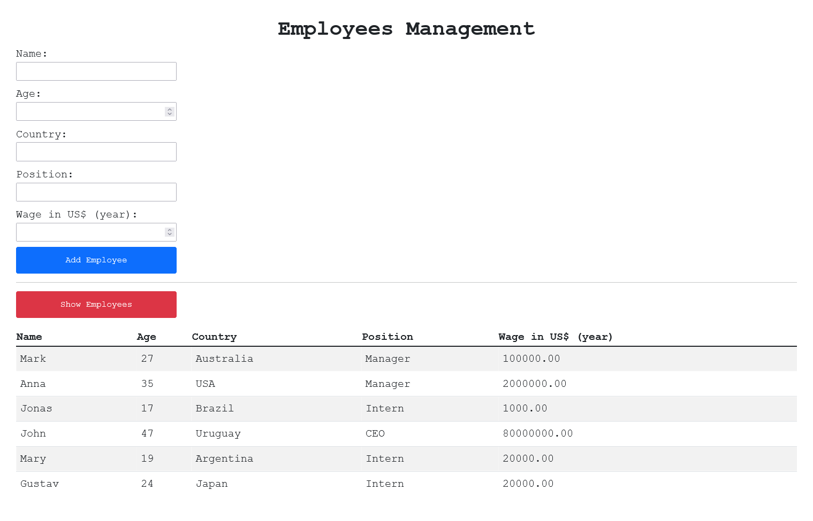

# Application to insert employees on a database using ReactJS, Bootstrap, NodeJS and MySQL

## Overview

### Screenshot

## My process

### Built with

-   Semantic HTML5
-   CSS with Bootstrap
-   JavaScript
-   React
-   NodeJS
-   MySQL

### What i learned

In this project i was able to apply my knowledge about the React library to develop a employee registration system on a MySQL database, with access via NodeJS, using the Bootstrap framework for styling.

## Author

-   GitHub - Vinícius dos Santos Verissimo (https://github.com/viniciusdsv93)
