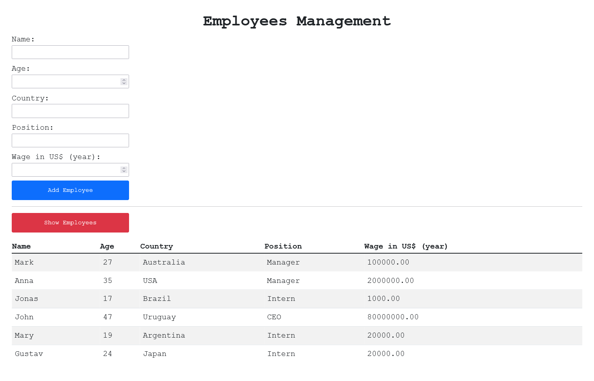

# Aplicação para cadastro de empregados em banco de dados usando ReactJS, Bootstrap, NodeJS e MySQL

## Visão Geral

### Screenshot

## Meu processo

### Construído com

-   HTML5 semântico
-   CSS com Bootstrap
-   JavaScript
-   React
-   NodeJS
-   MySQL

### O que aprendi

Neste projeto eu pude aplicar os conhecimentos envolvendo a biblioteca React para desenvolver um sistema de cadastro de empregados em um banco de dados MySQL, com acesso via NodeJS, utilizando o framework Bootstrap para estilização.

## Autor

-   GitHub - Vinícius dos Santos Verissimo (https://github.com/viniciusdsv93)
